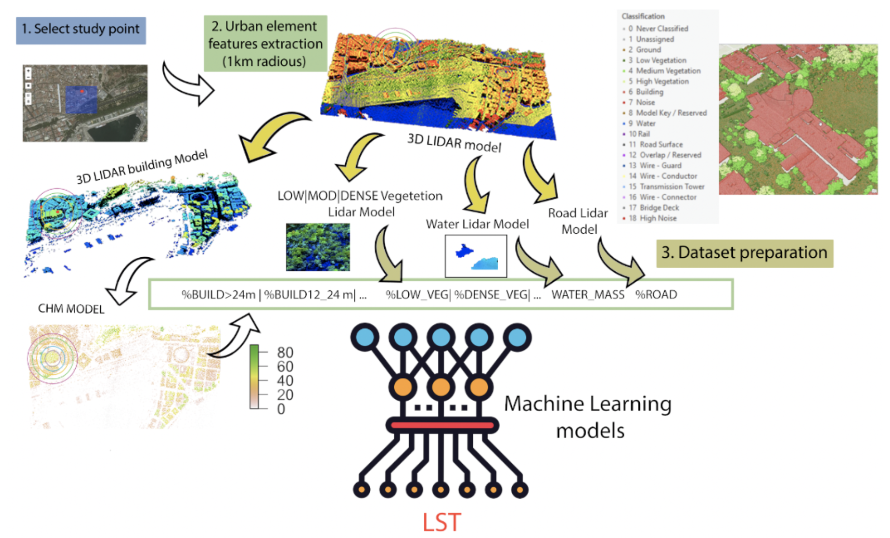
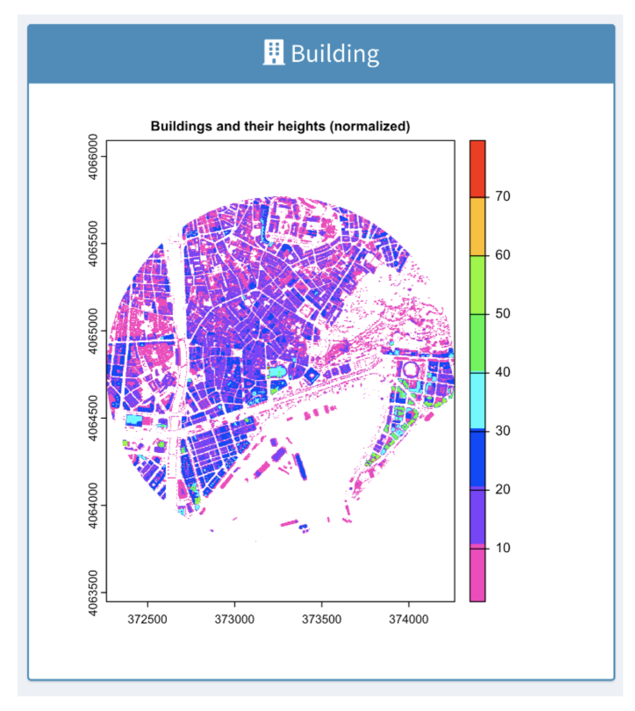
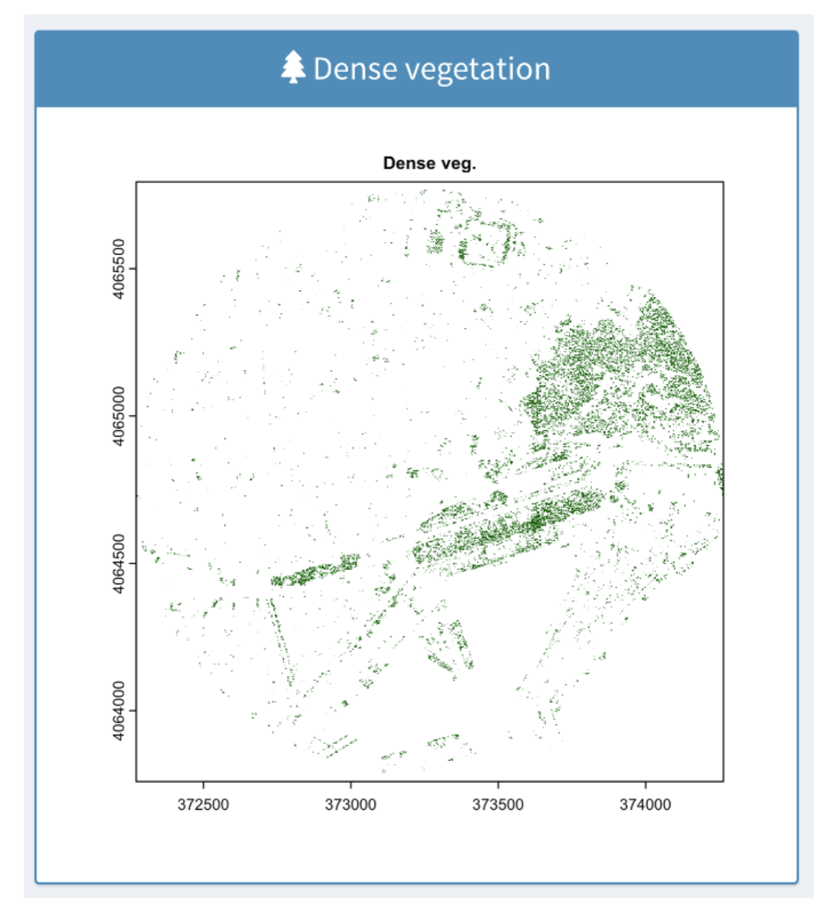
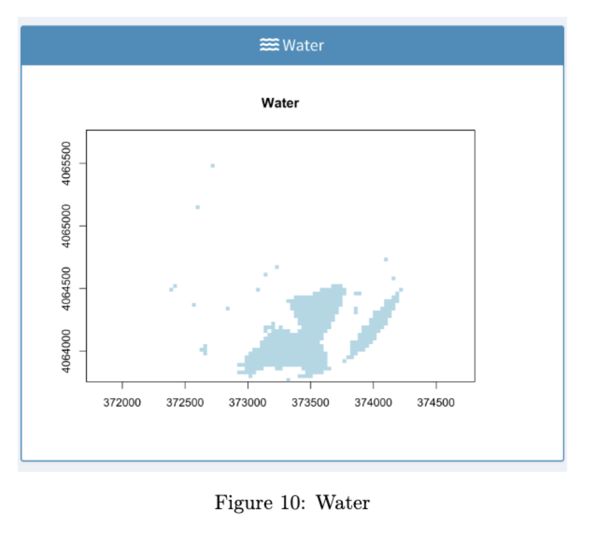
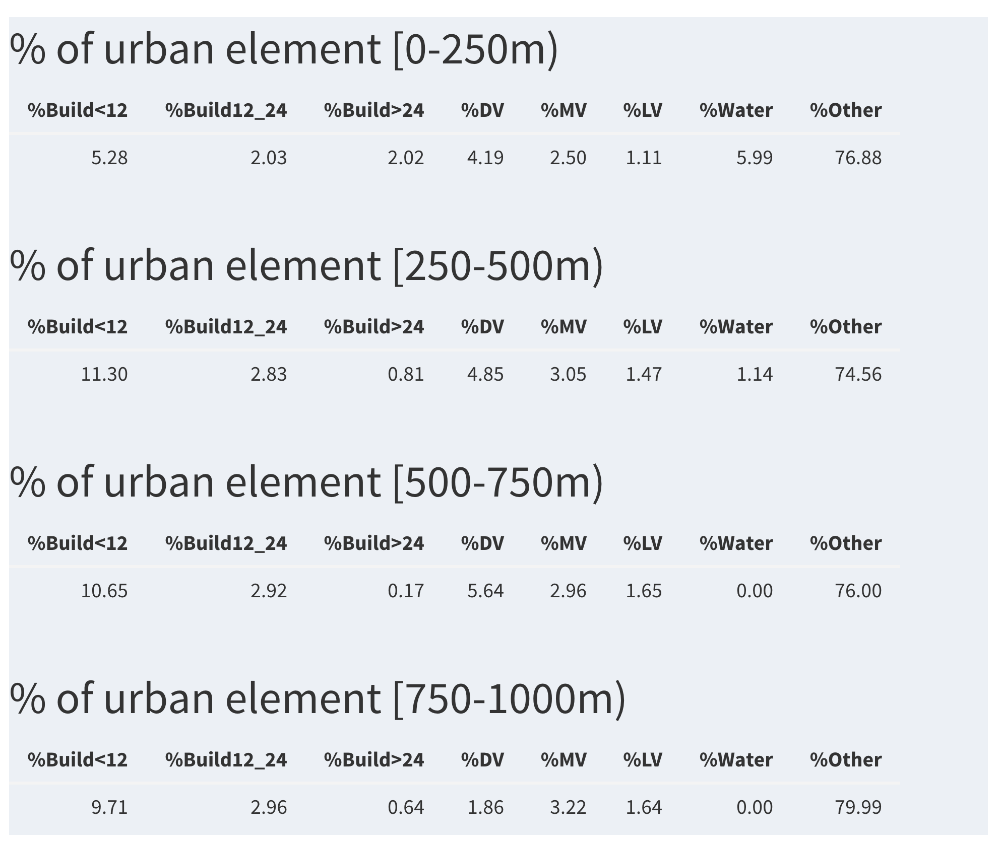
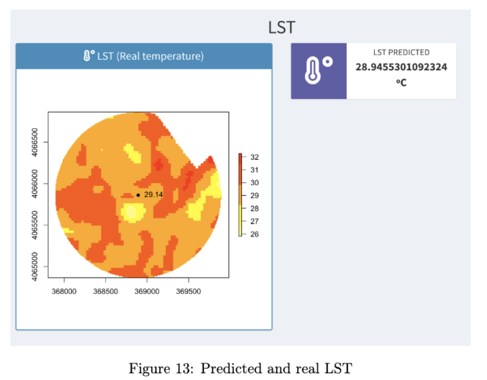
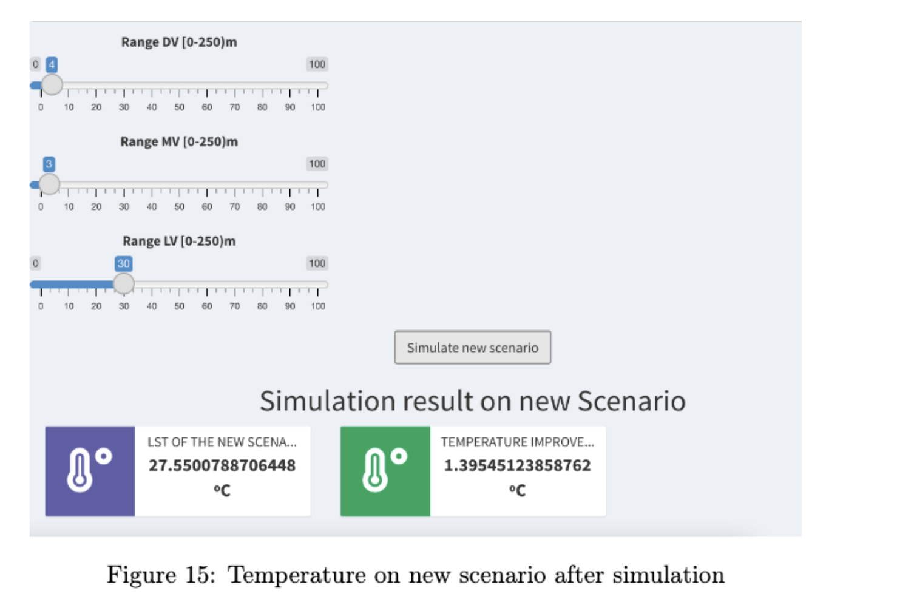

<!--
*** Thanks for checking out this README Template. If you have a suggestion that would
*** make this better, please fork the repo and create a pull request or simply open
*** an issue with the tag "enhancement".
*** Thanks again! Now go create something AMAZING! :D
-->

<!-- PROJECT SHIELDS -->
<!--
*** I'm using markdown "reference style" links for readability.
*** Reference links are enclosed in brackets [ ] instead of parentheses ( ).
*** See the bottom of this document for the declaration of the reference variables
*** for contributors-url, forks-url, etc. This is an optional, concise syntax you may use.
*** https://www.markdownguide.org/basic-syntax/#reference-style-links
-->

<!-- PROJECT LOGO -->
 

  
  

  <h3 align="center">Tool that allows estimating the temperature (LST) at any point in any city, analyzing the urban characteristics (buildings, vegetation, water,...) detected within the 1 km radius. around. The system allows you to simulate the temperature that the most unfavorable points would have in different green infrastructure scenarios.</h3>

  

    Learn in a simple and intuitive way how you would improve the temperature in the most unfavorable areas of any city by adding green infrastructure with just a few "clicks". 
  

### Tecnologies

The technology currently used for the development of the application is as follows:

* [R](https://cran.r-project.org/)
* [R-Studio](https://rstudio.com/)
* [R-Shiny](https://shiny.rstudio.com/)
* R-libraries
* [Lidar](http://centrodedescargas.cnig.es/CentroDescargas/index.jsp)
* Landsat-8 satellite images of the city to be analized+
* Sentinel-2 satellite images of the city to be analized

### Contents

1. Script for model training (models_script.rmd)
2. Shiny web application (this app use a model trained over Malaga city)
3. Some lidar images from Malaga city

### Steps

1. Clone the repository
2. Open R scripts and install R packages
3. Open server.r and launch shiny app

### Paper

The proposed methodology and tool is described in the paper "URSUS_LST: URban SUStainability intelligent
system for predicting the impact of urban green infrastructure on land surface temperatures" published in the journal "Environmental Modelling & Software". 

<!-- USAGE EXAMPLES -->
## Uso

* Select the point for LST prediction over the map of the study city
* Push LST prediction button
* System will be extract urban features percentages on 1 km of radious
* Tool plot the percentage for each processed feature: low vegetation, dense vegetation, water, building on different height range
* Finally, the system plot the LST predicted and real LST in selected point
* From this point on, the system allows estimates of the temperature at the point to be made by modifying the characteristics of the surrounding vegetation.

  
    
    
    
  </a>
    
    
    

<!-- CONTACT -->
## Contact

Luis Pérez Urrestarazu  - lperez@us.es
 
José del Campo Ávila  - jcampo@uma.es
 
Domingo López Rodríguez  - dominlopez@uma.es
 
Francisco Rodríguez Gómez  - francisco.rdg.gmz@uma.es

<!-- ACKNOWLEDGEMENTS -->
## Agradecimientos

This work has been supported by the project RTI2018-095097-BI00 in the call for R&D+i Projects 2018 of the Ministry of Science, Innovation and Universities, Spain

[product-screenshot-1]: 1.png
[product-screenshot-2]: 2.png
[product-screenshot-3]: 3.png
[product-screenshot-4]: 4.png
[product-screenshot-5]: 5.png
[product-screenshot-6]: 6.png
[product-screenshot-7]: 7.png
